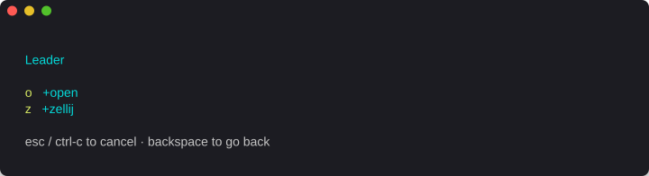
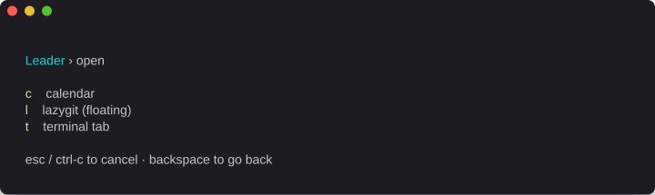

# zellij-which-key

A small which-key style leader-key launcher for [zellij](https://zellij.dev),
rendered with [Ink](https://github.com/vadimdemedes/ink).

<p align="center">
  <br/>
  <em>press <code>o</code> …</em><br/>
  
</p>

It's meant to be launched inside a **floating zellij pane** bound to a leader
key (e.g. `Ctrl+Space`). When the user finishes typing a key sequence, the
chosen command takes over the floating pane via stdio inheritance — so a TUI
like `calendar-tui` simply replaces the menu, and the pane closes when the TUI
exits.

## Install

```sh
pnpm install
pnpm build
pnpm link --global       # exposes `zellij-which-key` on PATH
```

## Configure

Drop a YAML config at `~/.config/zellij-which-key/config.yaml`:

```yaml
title: Leader

keys:
  o:
    label: open
    keys:
      c:
        label: calendar
        run: calendar-tui
```

Each entry under `keys` is either a **submenu** (has nested `keys:`) or a
**leaf** with exactly one *action* field. Inspired by
[which-key.nvim](https://github.com/folke/which-key.nvim)'s design — the
leaf's rhs is a typed action, not just "exec a string".

### Action types

| field    | shape                                | behavior                                                                 |
| -------- | ------------------------------------ | ------------------------------------------------------------------------ |
| `run`    | string                               | replace the (floating) which-key pane with the command (`sh -c <cmd>`)   |
| `pane`   | string \| `{ cmd, floating?, ... }`  | open a new zellij pane via `zellij action new-pane`, close which-key pane |
| `tab`    | string \| `{ cmd?, name?, ... }`     | open a new zellij tab via `zellij action new-tab`                        |
| `zellij` | list of strings                      | run `zellij action <args...>` directly (detach, go-to-next-tab, ...)     |

Shared optional fields on any leaf: `label`, `desc`, `cwd`.

### Example

```yaml
keys:
  o:
    label: open
    keys:
      c:
        label: calendar
        run: calendar-tui                # take over this pane
      l:
        label: lazygit (floating)
        pane: { cmd: lazygit, floating: true }
  z:
    label: zellij
    keys:
      d:
        label: detach
        zellij: [detach]
```

The config path can be overridden via `--config PATH` or
`$ZELLIJ_WHICH_KEY_CONFIG`.

## Wire it into zellij

In `~/.config/zellij/config.kdl`, inside the `shared` block:

```kdl
bind "Ctrl Space" {
    Run "zellij-which-key" {
        floating true
        hold_on_close false
        width "70%"
        height "60%"
    }
}
```

Zellij doesn't hot-reload keybinds, so start a fresh session to pick the
binding up.

## Keys

| key            | action                              |
| -------------- | ----------------------------------- |
| any config key | descend into submenu / run command  |
| `backspace`    | pop one menu level                  |
| `esc`, `ctrl+c`| cancel and close the floating pane  |
| `q` (at root)  | cancel                              |

## Screenshots

The images above are regenerated by `scripts/screenshot.sh`, which pipes the
output of `zellij-which-key --demo <path>` (a non-interactive ANSI dump of a
menu frame) through [charmbracelet/freeze](https://github.com/charmbracelet/freeze).
To refresh them locally:

```sh
go install github.com/charmbracelet/freeze@latest
pnpm build
./scripts/screenshot.sh
```

## Status

v0.2 — nested submenus, YAML config, typed actions (`run` / `pane` / `tab` /
`zellij`). `tab.cmd` is not yet wired through (zellij CLI limitation). No
hydra-mode / hold-open behavior yet.
